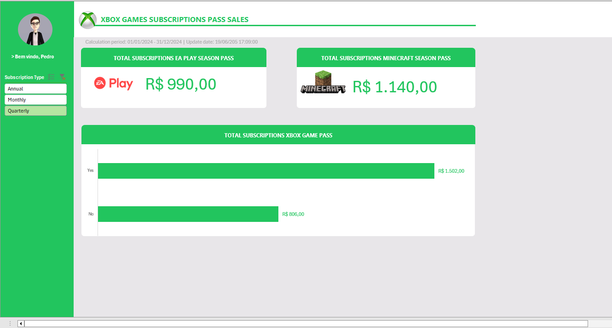

# 🎮 Dashboard de Vendas Xbox – Excel

## 📈 Visão Geral

Este projeto apresenta um dashboard de vendas interativo criado em Microsoft Excel, com o objetivo de transformar dados brutos em informações visuais e úteis para tomada de decisão.

---

## 🧠 Perguntas de Negócio Respondidas

1. 💰 Qual o faturamento total de vendas de planos anuais (incluindo todas as assinaturas agregadas)?
2. 🔁 Qual o faturamento total de vendas de planos anuais, separando os que têm autorrenovação dos que não têm?
3. 🕹️ Qual o total de vendas de assinaturas do EA Play?
4. ⛏️ Qual o total de assinaturas do Minecraft Season Pass?

---

## 🧩 Componentes do Dashboard

- 📌 **Menu de filtro lateral interativo**
  - Permite segmentar os dados por tipo de assinatura e autorrenovação
- 🔢 **Cards com Big Numbers**
  - Total de assinaturas do EA Play Season Pass
  - Total de assinaturas do Minecraft Season Pass
- 📊 **Gráfico horizontal**
  - Mostra o total de assinaturas do Xbox segmentado por autorrenovação

---

## 💻 Como Visualizar

1. Baixe o arquivo `Dashboard_Xbox.xlsx` disponível neste repositório.
2. Abra no **Microsoft Excel 365** (ou versão superior compatível com segmentações e gráficos dinâmicos).
3. Utilize os filtros no menu lateral para interagir com os dados.
4. Os gráficos e indicadores serão atualizados automaticamente conforme suas seleções.

---

## 📎 Tecnologias Utilizadas

- Microsoft Excel 365
- Tabelas Dinâmicas
- Segmentações de Dados
- Gráficos Interativos
- Design focado em UX de dashboards

---

## 🧑‍💻 Autor

**Izidoro Henrique Melo**  
Esse projeto foi feito como um exercício de análise e visualização de dados no Excel,  
durante o Bootcamp Santander Excel com Inteligência Artificial.

---
